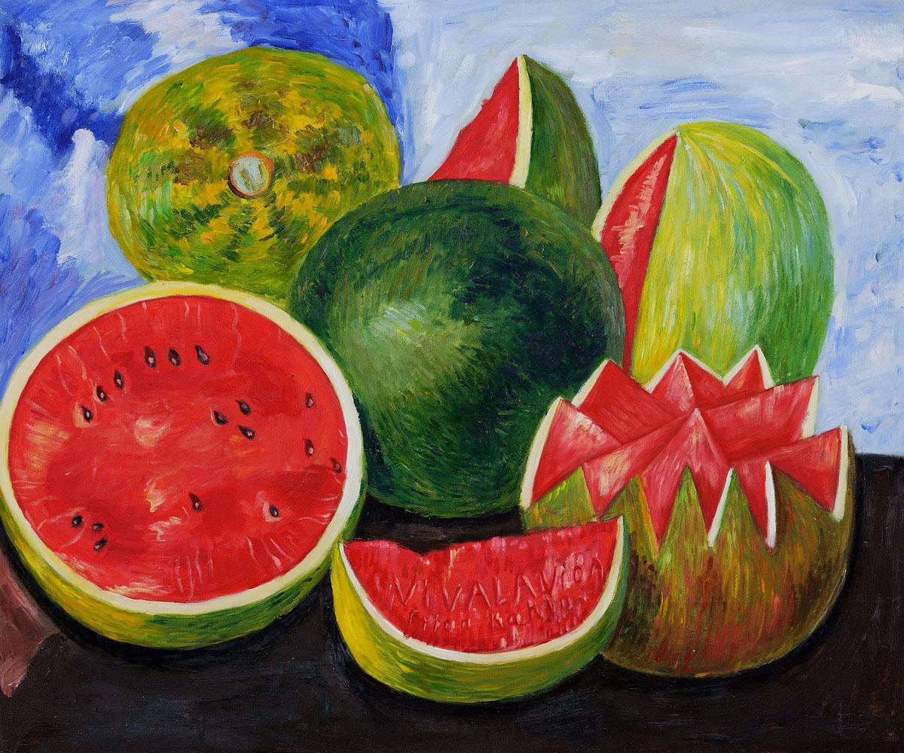
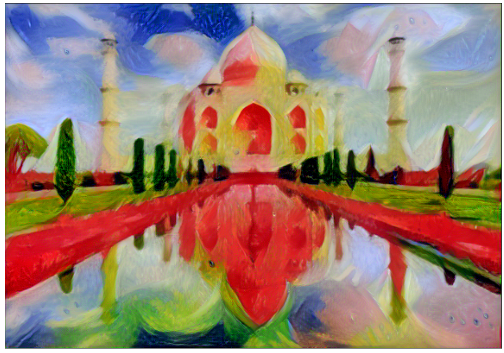

## Neural Style Transfer

#### Pytorch Implementation of original Neural Style Transfer Paper <a href="https://arxiv.org/abs/1508.06576">A Neural Algorithm of Artistic Style</a>

### What is Neural Style Transfer

##### Neural style transfer is an optimization technique used to take two images—a content image and a style reference image (such as an artwork by a famous painter)—and blend them together so the output image looks like the content image, but “painted” in the style of the style reference image.

### Model Used
##### Pre-trained VGG-19

### Content Image

### Style Image

### Result of Style Transfer

